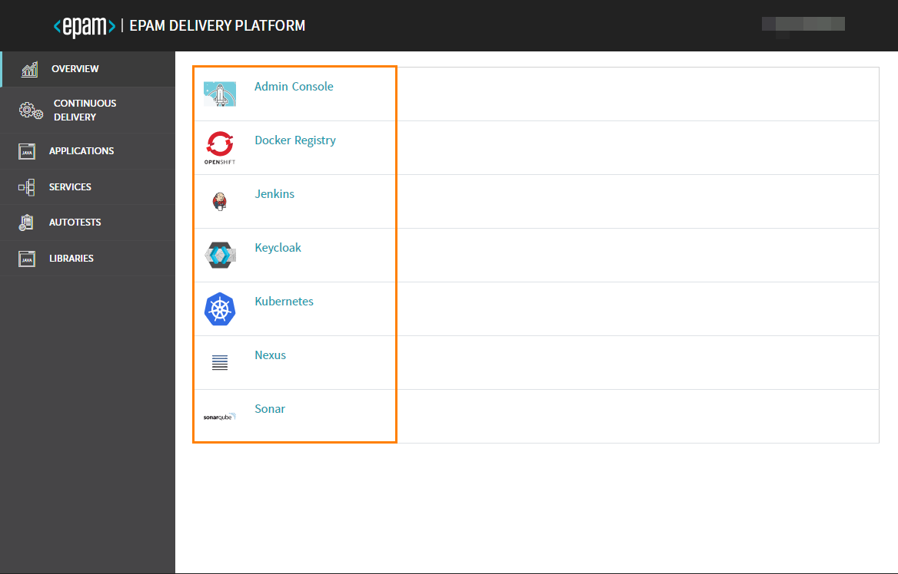

# EDP Component Operator

EDP component operator is an extension for K8S/OpenShift that is used for managing the EDP CI/CD components in the Admin Console tool.

At the moment, it is delivered as a Custom Resource Definition without any controllers.
Some of EDP components are predefined and installed automatically. 

Additionally, there is the ability to use the custom components and afterwards consume the respective component data from Admin Console. 

The basic Custom Resource for EDP Component cab be as follows:
```yaml
apiVersion: v1.edp.epam.com/v1alpha1
kind: EDPComponent
metadata:
  name: example-edpcomponent
spec:
  type: jenkins
  url: https://example-jenkins
  icon: base64encoded_icon
```

_**NOTE:** Pay attention to the icon field that should be a base64 encoded._

As soon as the CR is created, it will appear on the main page of the Admin Console tool:



# How to Install Operator

EDP installation can be applied on two container orchestration platforms: OpenShift and Kubernetes.

_**NOTE:** Installation of operators is platform-independent, that is why there is a unified instruction for deploying._

### Prerequisites
* Linux machine or Windows Subsystem for Linux instance with [Helm 3](https://helm.sh/docs/intro/install/) installed;
* Cluster admin access to the cluster;
* EDP project/namespace is deployed by following one of the instructions: [edp-install-openshift](https://github.com/epmd-edp/edp-install/blob/release-2.3/documentation/openshift_install_edp.md#edp-project) or [edp-install-kubernetes](https://github.com/epmd-edp/edp-install/blob/release-2.3/documentation/kubernetes_install_edp.md#edp-namespace).

### Installation

In order to install the edp-component-operator, follow the steps below:

1. Go to the [releases](https://github.com/epmd-edp/edp-component-operator/releases) page of this repository, choose a version, download an archive, and unzip it;

    _**NOTE:** It is highly recommended to use the latest released version._
2. Navigate to the unzipped directory and deploy an operator:
    ```bash
    helm install edp-component-operator --namespace <edp_cicd_project> --set name=edp-component-operator --set namespace=<edp_cicd_project> --set platform=<platform_type> deploy-templates
    ```
    - _<edp_cicd_project> - a namespace or a project name (in case of OpenShift) that is created by one of the instructions: [edp-install-openshift](https://github.com/epmd-edp/edp-install/blob/release-2.3/documentation/openshift_install_edp.md#edp-project) or [edp-install-kubernetes](https://github.com/epmd-edp/edp-install/blob/release-2.3/documentation/kubernetes_install_edp.md#edp-namespace);_ 
    - _<platform_type> - a platform type that can be "kubernetes" or "openshift";_

    _**NOTE**: As the edp-component-operator contains only CRD, the "Error: no objects visited" error message will be displayed._
3. Make sure that edpcomponents.v1.edp.epam.com CRD exists in your cluster.

### Local Development
In order to develop the operator, first set up a local environment. For details, please refer to the [Local Development](documentation/local_development.md) page.