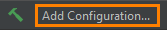
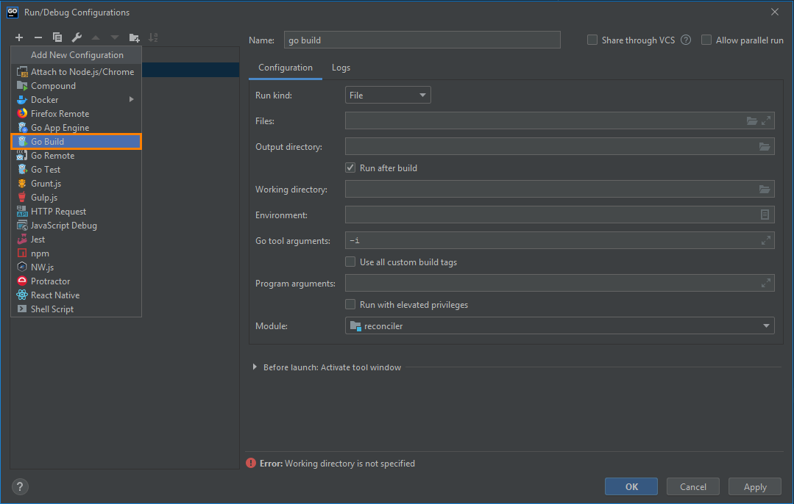
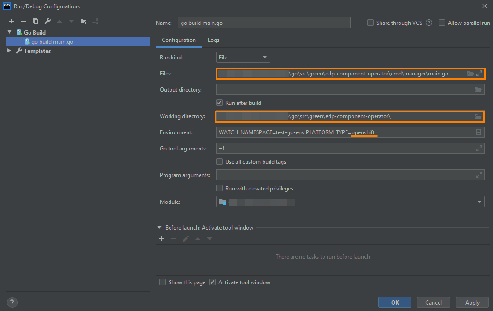

# Local Development
### Requirements
* Golang version higher than 1.13;

>_**NOTE**: The GOPATH and GOROOT environment variables should be added in PATH._
>```
>export GOPATH=C:\Users\<<username>>\go
>export GOROOT=C:\Go
>```

* Configured access to the VCS, for details, refer to the [Gerrit Setup for Developer](https://kb.epam.com/display/EPMDEDP/Gerrit+Setup+for+Developer) page;
* GoLand Intellij IDEA or another IDE.

### Operator Launch
In order to run the operator, follow the steps below:

1. Clone repository;
2. Open folder in GoLand Intellij IDEA, click the  button and select the **Go Build** option:
 
3. In Configuration tab, fill in the following:

    3.1. In the Field field, indicate the path to the main.go file;
    
    3.2. In the Working directory field, indicate the path to the operator;
    
    3.3. In the Environment field, specify the platform name (OpenShift/Kubernetes);
    
4. Run 'go build main.go' (Shift+F10);
5. Check the operator logs in output console: 
```
{"level":"info","ts":1580909580.038896,"logger":"cmd","msg":"Go Version: go1.13.7"}
{"level":"info","ts":1580909580.0398724,"logger":"cmd","msg":"Go OS/Arch: windows/amd64"}
{"level":"info","ts":1580909580.0398724,"logger":"cmd","msg":"Version of operator-sdk: v0.8.0+git"}
{"level":"info","ts":1580909580.0408487,"logger":"leader","msg":"Trying to become the leader."}
{"level":"info","ts":1580909580.0408487,"logger":"leader","msg":"Skipping leader election; not running in a cluster."}
{"level":"info","ts":1580909582.473165,"logger":"cmd","msg":"Registering Components."}
```

### Exceptional Cases
After starting the Go build process, the following error will appear: 
```
go: finding github.com/openshift/api v3.9.0
go: finding github.com/openshift/client-go v3.9.0
go: errors parsing go.mod:
C:\Users\<<username>>\Desktop\EDP\edp-admin-console\go.mod:36: require github.com/openshift/api: version "v3.9.0" invalid: unknown revision v3.9.0

Compilation finished with exit code 1
```
To resolve the issue, update the go dependency by applying the Golang command:

```
go get github.com/openshift/api@v3.9.0
```